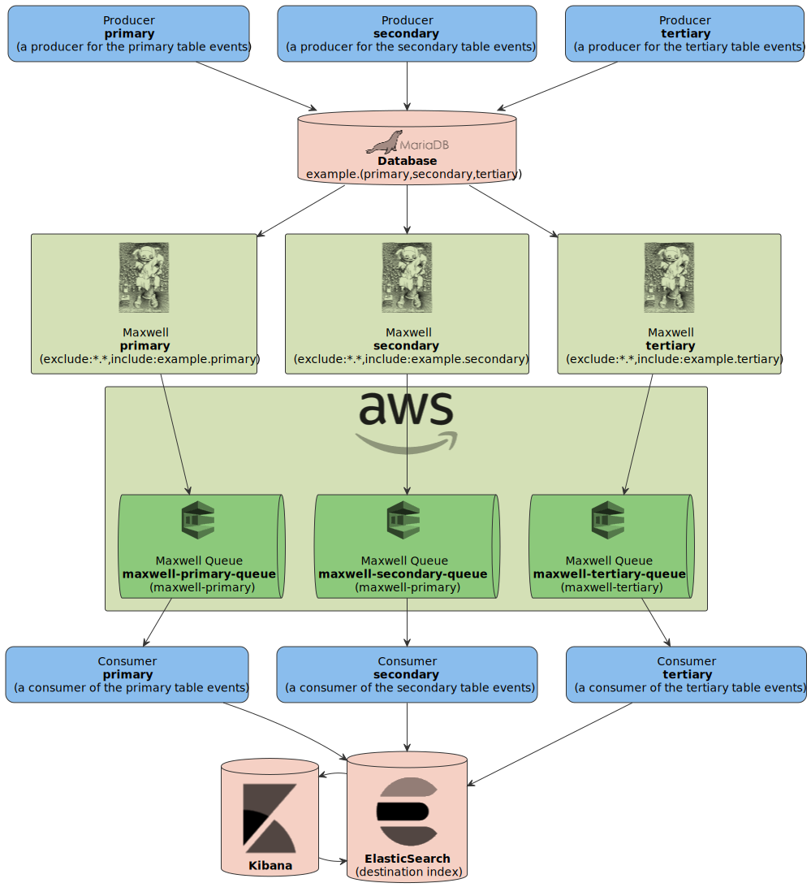

# Maxwell Playground

This repository contains basic **MariaDB**, **Maxwell** and **AWS** **SQS** [localstack](https://localstack.cloud/) configuration.

To run this example **Docker** installation is required.

More detailed documentation of the **Maxwell** daemon can be found [here](https://maxwells-daemon.io/).

## Diagrams

#### Abstract example

#### ElasticSearch example

## Makefile

Use `Makefile` to run all the examples. To list all available options run `make`.

## Configuration

Use the following environment variable located in the `Makefile` to control number of threads and events.

- `PRODUCER_THREADS`
- `CONSUMER_THREADS`
- `PRODUCER_WAIT`
- `CONSUMER_WAIT`
- `TOTAL`

## Instructions

- Run `make up` to start everything up (this will also start consumers and producers).
- Run `make mariadb` to access database shell, run the below example SQL queries to create records.
- Run `make mariadb-insert-primary`, `make mariadb-insert-secondary` or `make mariadb-insert-tertiary` to insert database records manually.
- Run e.g. `make aws-sqs-receive-message-maxwell-primary` to consume primary queue (run `make` to see more options).
